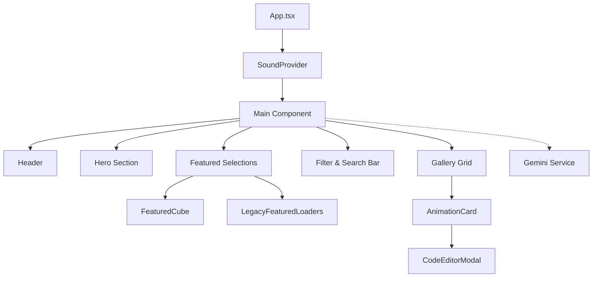
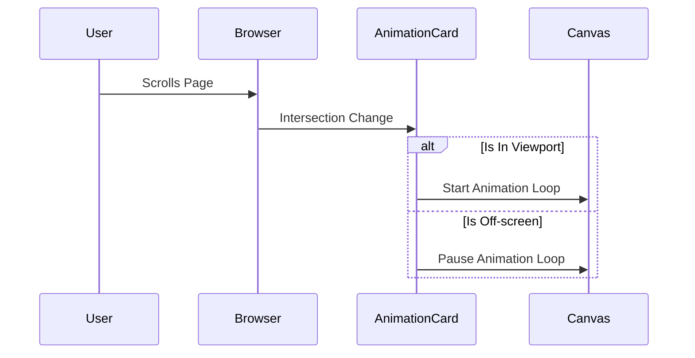

# KRACKED GALLERY // SYSTEM DOCUMENTATION

Welcome to the Kracked Gallery core repository. This is a high-performance archive of pixel-perfect loading animations and UI components designed for modern web terminals.

## SYSTEM OVERVIEW

The Kracked Gallery is a React-based single-page application (SPA) architected for visual impact and performance efficiency. It combines static asset delivery with real-time AI generation capabilities.

## CORE ARCHITECTURE

The system is built on a modular component architecture with a centralized state management flow.

### COMPONENT HIERARCHY



### DATA & STATE FLOW

The application maintains a unidirectional data flow. 

1.  **State Initialization**: The system loads `INITIAL_ANIMATIONS` from the encrypted constants layer.
2.  **Filter Engine**: React state hooks track search terms and category selections.
3.  **Dynamic Rendering**: The gallery grid computes the intersection of search queries and category filters to render visible assets.
4.  **AI Generation**: When triggered, the `geminiService` interfaces with the Google Generative AI protocol to synthesize new Tailwind-based components.

## PERFORMANCE OPTIMIZATION PROTOCOLS

To ensure a smooth user experience despite high graphical density, the system implements several low-level optimizations.

### VISUAL OPTIMIZATION: INTERSECTION OBSERVER

The `AnimationCard` utilizes the `IntersectionObserver` API to monitor component visibility. For canvas-based animations (Westworld category), the rendering loop is automatically suspended when the component leaves the viewport and resumed upon re-entry.



### AUDIO OPTIMIZATION: POOLING & THROTTLING

The `SoundManager` implements an audio pooling strategy to eliminate playback latency. Instead of creating new objects on every interaction, it cycles through a pre-warmed pool of `HTMLAudioElement` instances. Hover effects are throttled to prevent audio overlap during rapid navigation.

## TECHNICAL SPECIFICATIONS

-   **Framework**: React 19 (TypeScript)
-   **Build System**: Vite 6
-   **Styling**: Tailwind CSS Protocol
-   **Intelligence**: Google Gemini 1.5 Flash Preview
-   **Audio**: Low-latency pooling architecture

## DEPLOYMENT STEPS

### LOCAL CONFIGURATION

1.  Initialize dependencies:
    ```bash
    npm install
    ```

2.  Establish environment variables:
    Create a `.env` file in the root directory and append your API access key:
    ```text
    API_KEY=your_gemini_api_key_here
    ```

3.  Execute development server:
    ```bash
    npm run dev
    ```

### PRODUCTION BUILD

To compile the system for production deployment:
```bash
npm run build
```

The resulting optimized assets will be located in the `dist` directory.

## ARCHIVE CLASSIFICATIONS

The gallery categorizes assets into several sectors:
-   **SPINNNERS**: Circular motion analysis
-   **DOTS**: Sequential pulse arrays
-   **BARS**: Linear frequency modulations
-   **SHAPE SHIFT**: Geometric transformations
-   **WESTWORLD**: Advanced canvas-based 3D reconstructions
-   **AI GENERATED**: Synthetic UI components

---
TERMINAL LOG // END OF DOCUMENTATION
